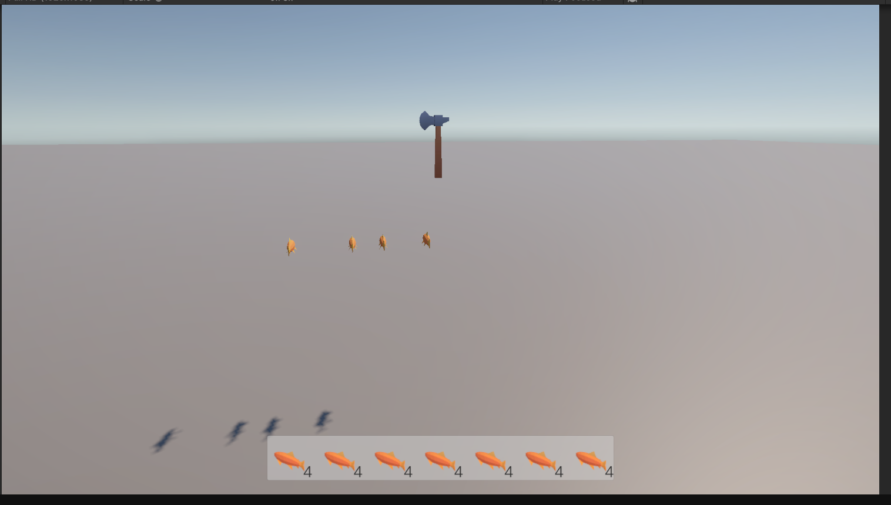
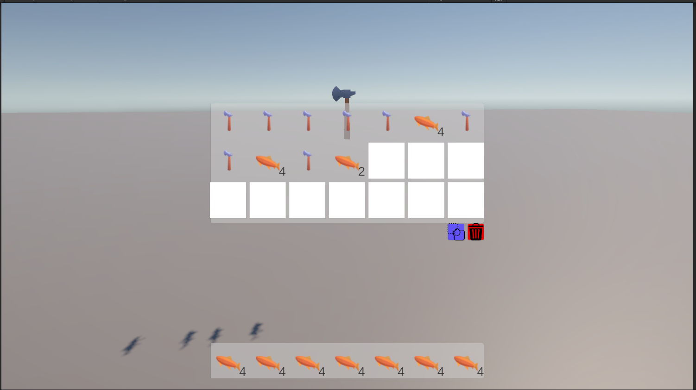
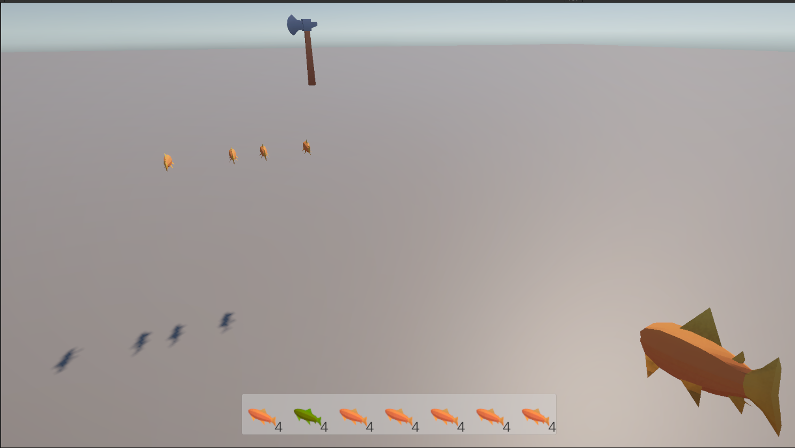
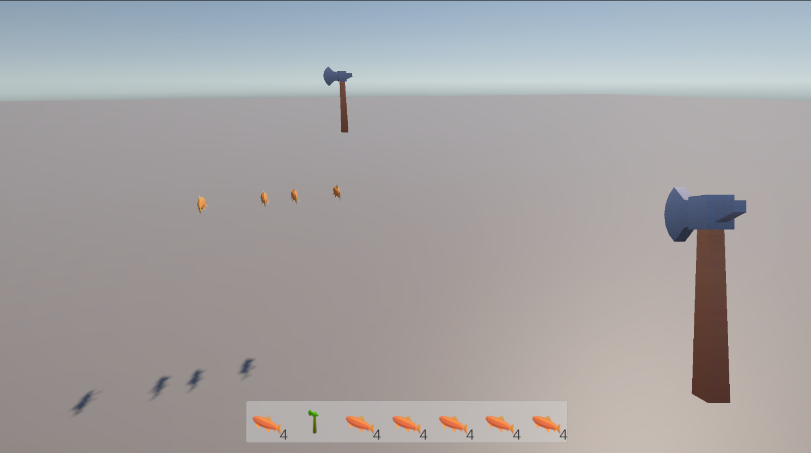

# SurvivalGame
Unity ile geliştirdiğim envaner sistemi

🎒 Unity Inventory System
Bu proje, Unity oyunlarında kullanılmak üzere geliştirilmiş basit ama genişletilebilir bir envanter (inventory) sistemi içerir. Oyuncular item toplayabilir, envanterde görüntüleyebilir, item'leri değiştirebilir, silebilir veya yere bırakabilir.

🚀 Özellikler
👤 Oyuncunun item toplamasını sağlayan sistem

🎛️ Slot tabanlı envanter (stacklenebilir öğeler dahil)

🔄 Item takası (swap) ve silme

⬇️ Yere item bırakma (drop)

🖼️ UI üzerinden envanter görüntüleme (SlotUI)

🛠️ Tool, Material, Food gibi farklı item türleri (ScriptableObject ile)

🪄 Otomatik prefab instantiate sistemi

🧩 Kullanılan Bileşenler
SCitem (Base item class)

SCTool, SCFood, SCMaterial (Item türleri)

SCInventory (ScriptableObject envanter)

Slot ve SlotUI (Envanter slot yapısı ve UI)

PlayerActions (item’leri tutma ve gösterme)

Inventory (envanter kontrol scripti)

Items (toplanabilir nesne scripti)

InventoryUIController (UI yönetimi)

🕹️ Kontroller
Tab: Envanteri aç/kapat

Jump: Zıplama (boşluk tuşu)

UI üstünden item seçimi, silme, bırakma gibi işlemler yapılabilir.

⚙️ Kurulum
Bu projeyi indir ya da klonla:

bash
Kopyala
Düzenle
git clone https://github.com/kullanici-adi/unity-inventory-system.git
Unity ile aç.

SCInventory nesnesini oluştur ve oyuncunun envanterine bağla.

Sahneye Inventory, InventoryUIController ve PlayerActions scriptlerini içeren nesneleri yerleştir.

Items prefab'larını sahneye yerleştir ve SCitem ScriptableObject'leri ile ilişkilendir.

🧪 Notlar
Stacklenebilir item'ler için canStackable = true olmalıdır.

Her ScriptableObject için itemPrefab atanmış olmalı. Aksi takdirde NullReferenceException alırsınız.

Prefab'lerin tag'i Item olmalıdır.

📸 Ekran Görüntüleri (isteğe bağlı)
(Buraya proje ekran görüntüleri ekleyebilirsin)

📄 Lisans
MIT lisansı veya dilediğin açık kaynak lisans türünü yazabilirsin.

İstersen bu metni Türkçe veya İngilizce tamamen olarak özelleştirebiliriz. Ekran görüntüsü, video veya animasyonla README’yi zenginleştirmek istersen de yardımcı olabilirim. İster misin?

